# **A strategy guide to speedrunning Minecraft**

**What is Minecraft?**

Minecraft is a game where your goal is to defeat the ender dragon. You achieve this by killing different mobs and gathering various resources. For a more in-depth description of Minecraft, check out [https://www.minecraft.net/en-us/about-minecraft](https://www.minecraft.net/en-us/about-minecraft).

**What is speedrunning?**

Speedrunning is when you try to beat a game, complete a goal, or get to a certain point in the shortest amount of time. Speedruns are normally timed.

**Overworld**

You will want to look for a plains village. They look like this:

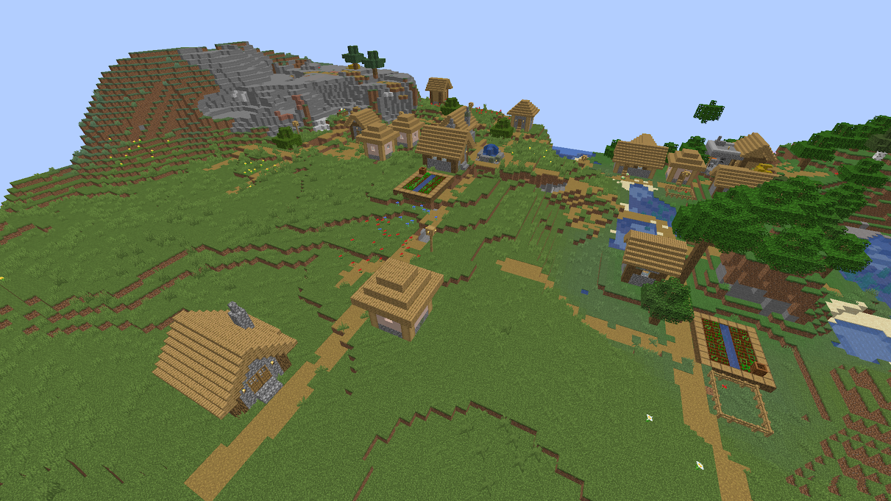

&quot;Plains village&quot;

You want to break the logs on the houses to make a pickaxe. With the pickaxe, you must break the cobblestone so that you have enough for an axe, pickaxe, and a hoe. Also, make sure to grab their beds.

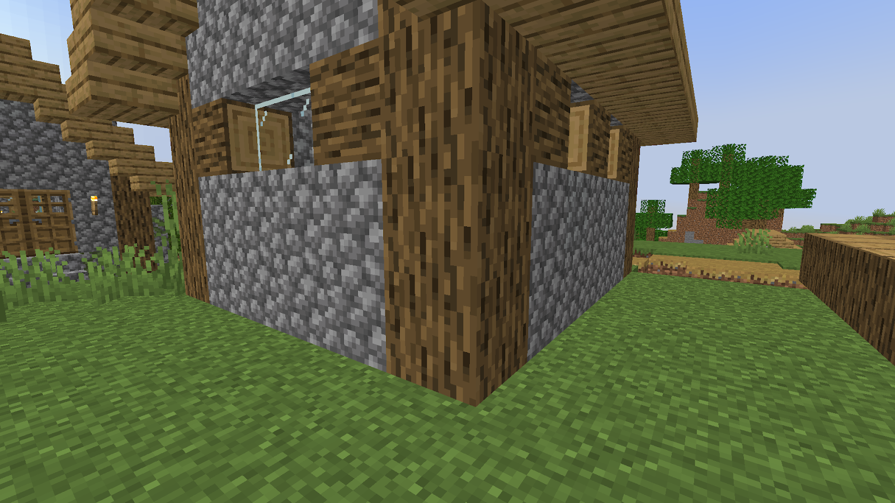

&quot;Plains village house&quot;

Find the hay bales in the village, use the hoe to mine them, and make bread. This bread should last you for the rest of your run.

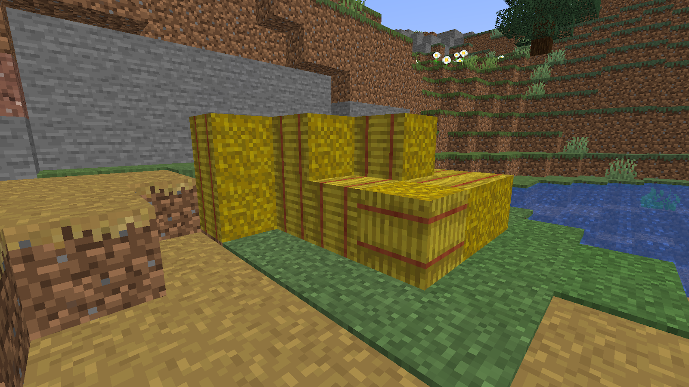

&quot;Plains village hay bales&quot;

When in the village, a quick way to get iron is to kill the iron golem. You can do this by hitting it once, then running away and building up three blocks. By doing this, it will not be able to hit you while you can still hit it. With the iron, you will want to make a bucket, and a flint and steel.

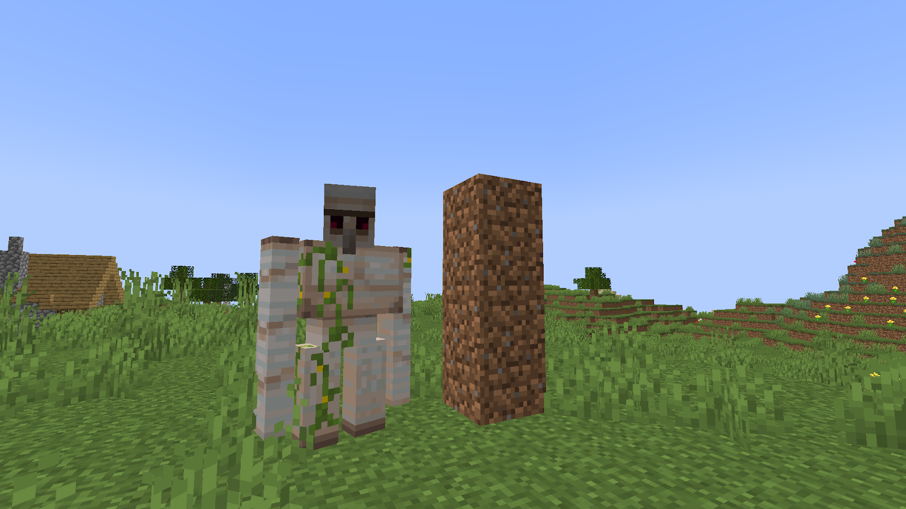

&quot;Iron golem next to three-block high pillar&quot;

To make a fast nether portal, look for an area in the lava pool with four lava side by side. Place a block on the third lava like this:

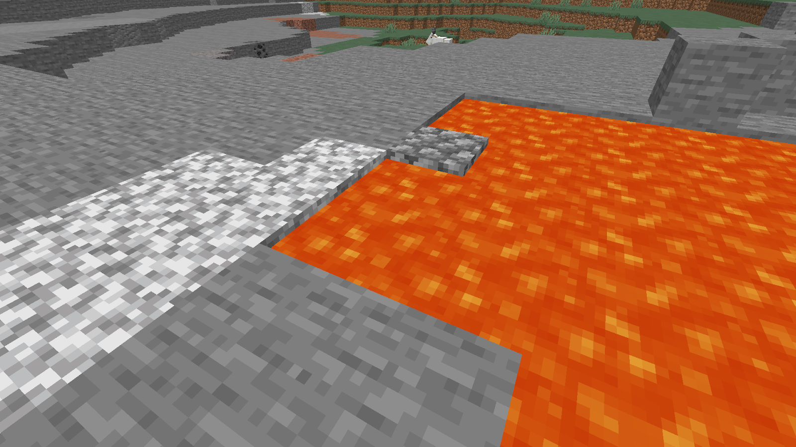

&quot;Block place in lava&quot;

Place your water beside the block you placed like this:

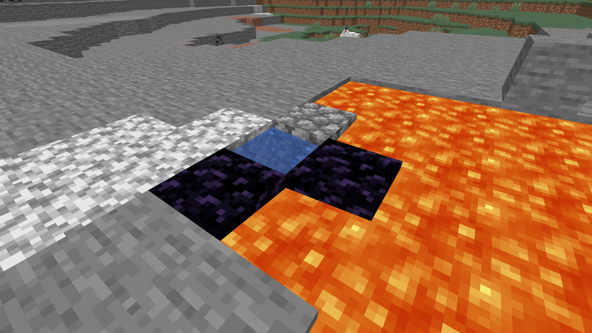

&quot;Water placed beside block&quot;

Break the block:

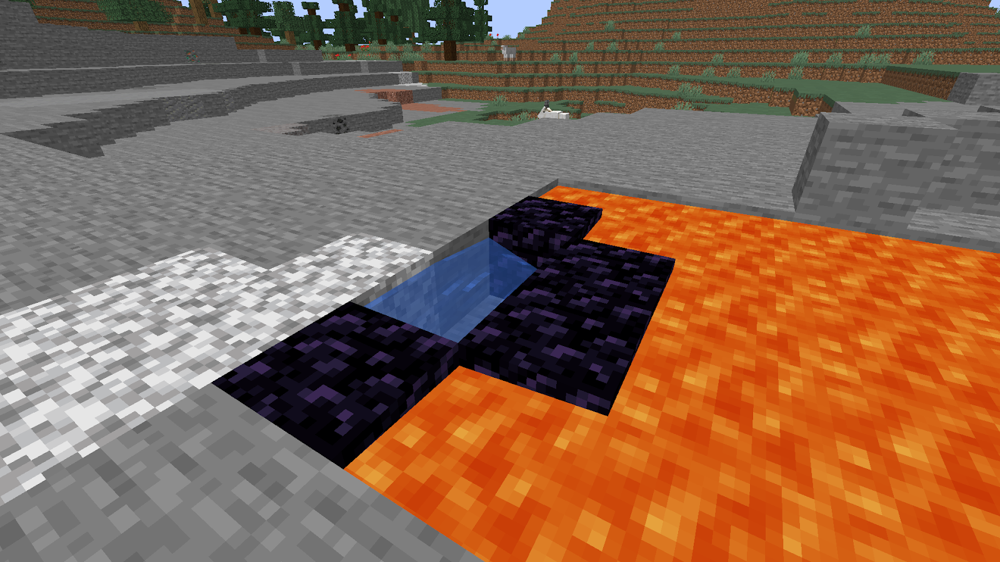

&quot;The block has been broken&quot; 

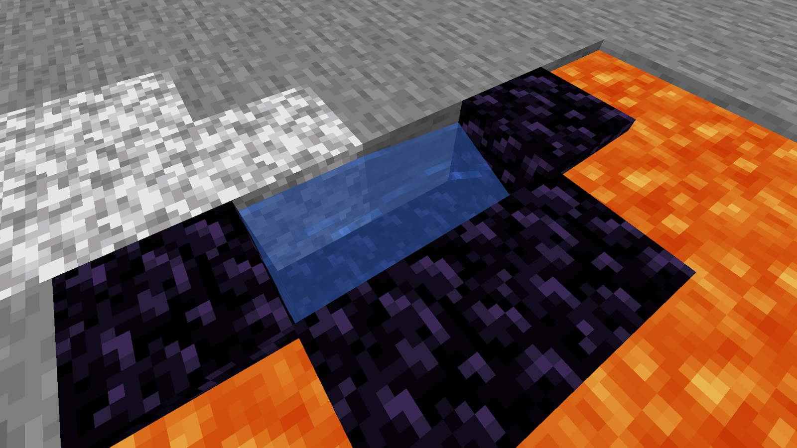

Break under the water if there is no obsidian and fill it up with lava:

&quot;Breaking underneath the water&quot;

Go one block behind one of the obsidian corners. Then place three blocks up from there and one more towards the obsidian corner. On the opposite side, place one block behind the obsidian, then place one more towards the inside. Place your water on the third block up on the pillar facing the inside of the portal. When done, it should look like this:

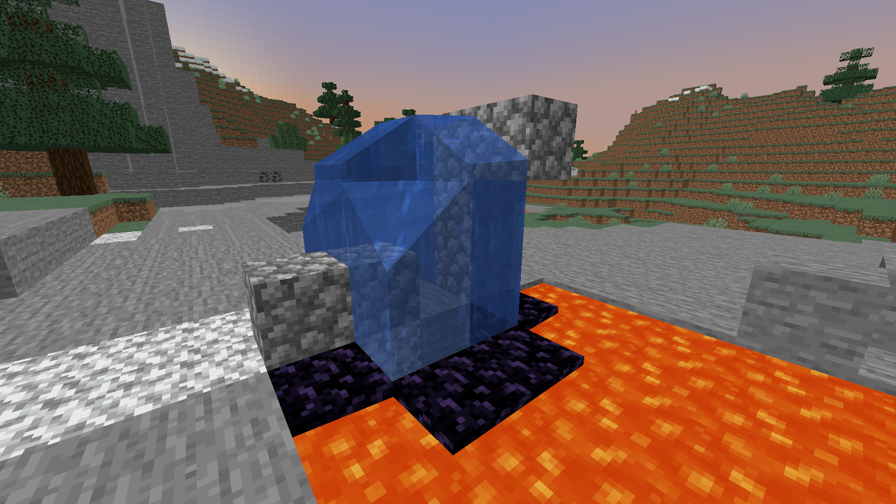

&quot;Blocks placed in the layout to create a portal&quot;

Cycle between filling up your bucket with lava and placing it in the shape of the portal.

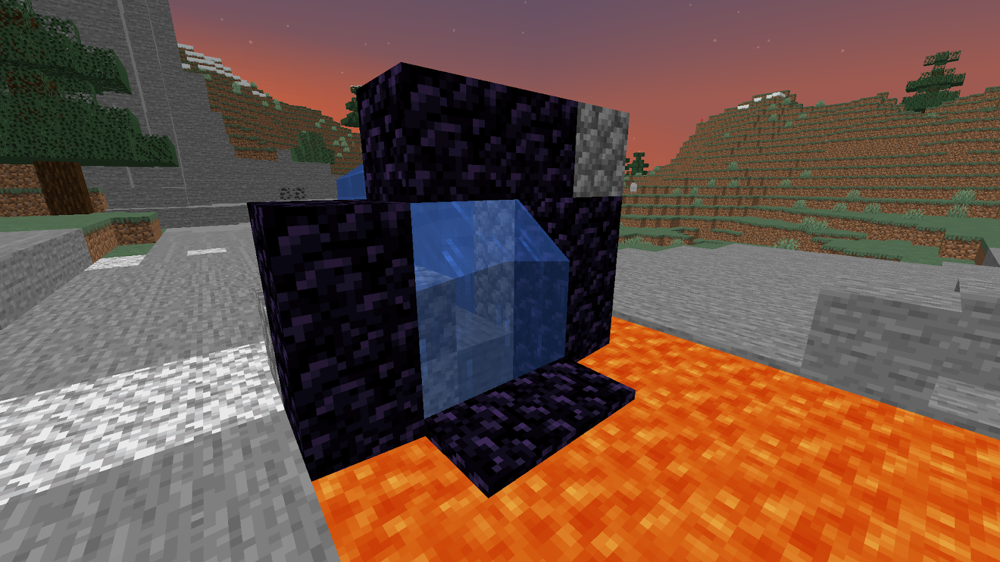

&quot;Portal has been filled&quot;

**Nether**

You will need to learn how to navigate and grab all the gold blocks in every type of bastion.

**Types of bastions and the number of gold blocks that can spawn inside of them**

| **Type** | **Number of gold blocks** | **Image** |
| :---: |:---: | :---: |
| Bridge | 23 |  &quot;Image of bridge bastion&quot; | 
| Hoglin stable | 11 |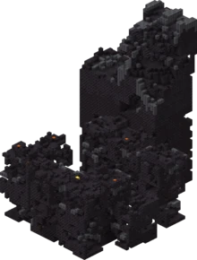&quot;Image of hoglin stable bastion&quot; |
|  Housing | 10 | 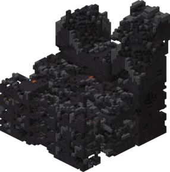 &quot;Image of housing bastion&quot; |
| Treasure room | 27 |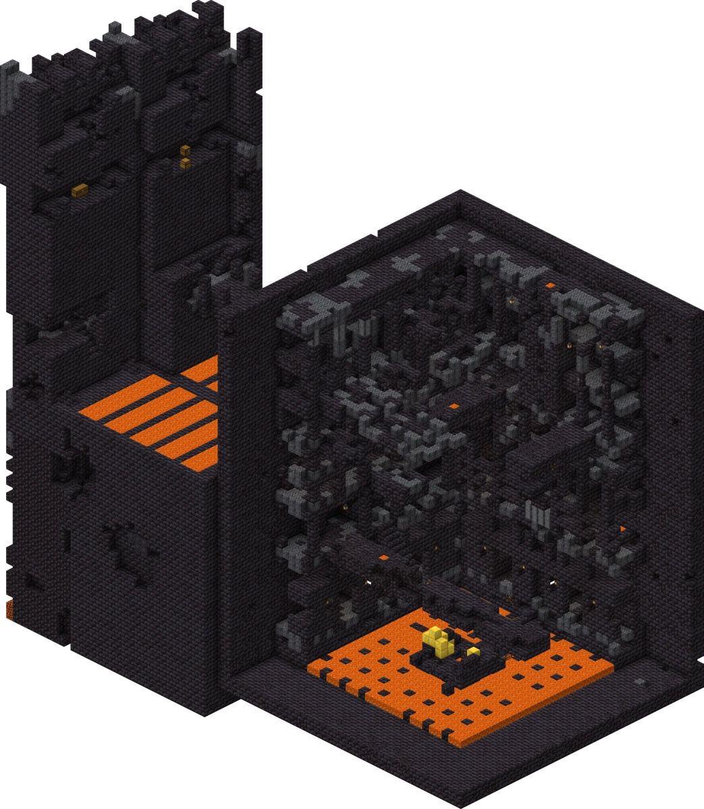 &quot;Image of treasure room bastion&quot;|

You will need to trade the gold with piglins for ender pearls. You will want to hold on to some obsidian.

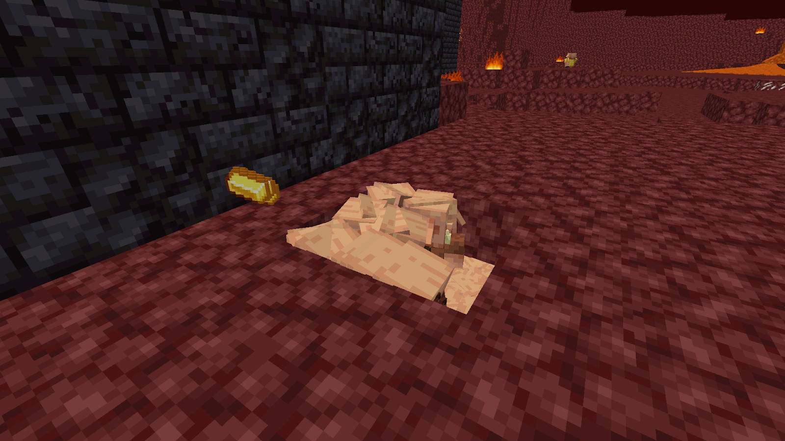

&quot;Trading with piglins&quot;

**End**

As soon as you enter the end, go to the bedrock pillar and place two pieces of obsidian and run away. It should look like this:

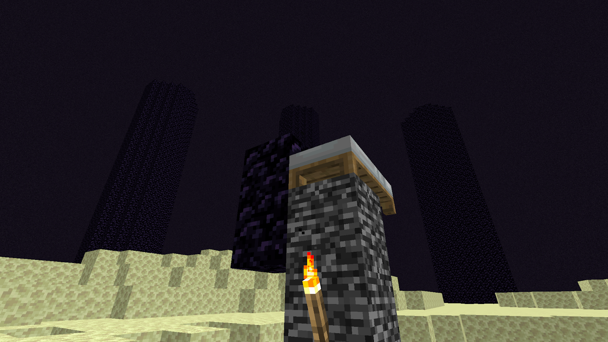

&quot;Blocks placed above bedrock pillar&quot;

When the dragon starts perching, run into the bedrock pillar and place your bed on top of the bedrock pillar. Start placing beds and right-clicking when the dragon is exposed.

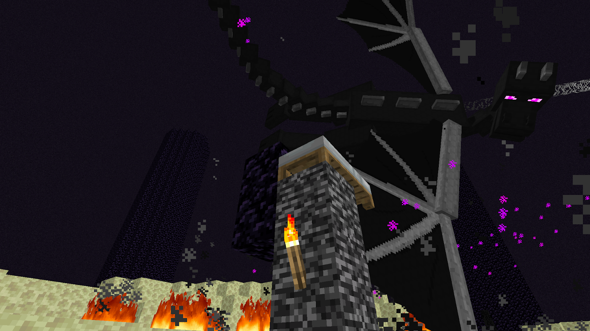

&quot;Bed placed above bedrock pillar&quot;

When done properly, the dragon will die. Jump in the portal and stop the time.

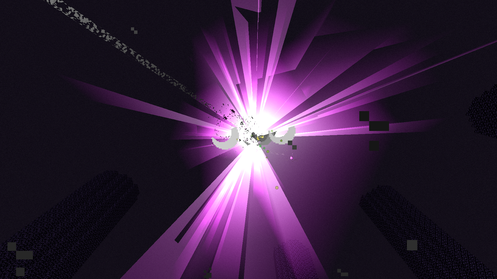

&quot;Dragon death animation&quot;

**Next Steps**

Now that you have some basic strategies to implement in your next speed run. You should check out [https://www.speedrun.com/mc](https://www.speedrun.com/mc) to watch leaderboard speed runs and learn from their gameplay.

